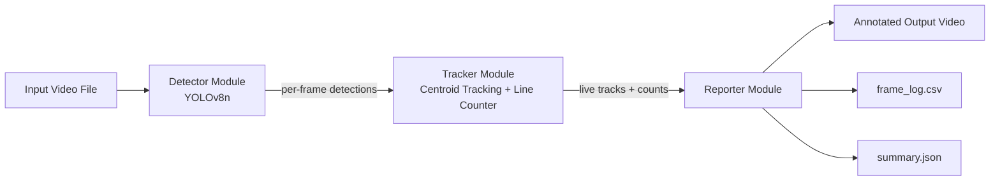
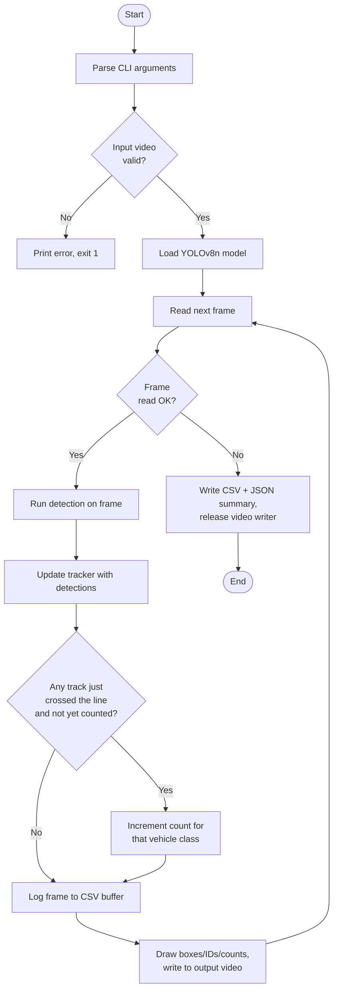
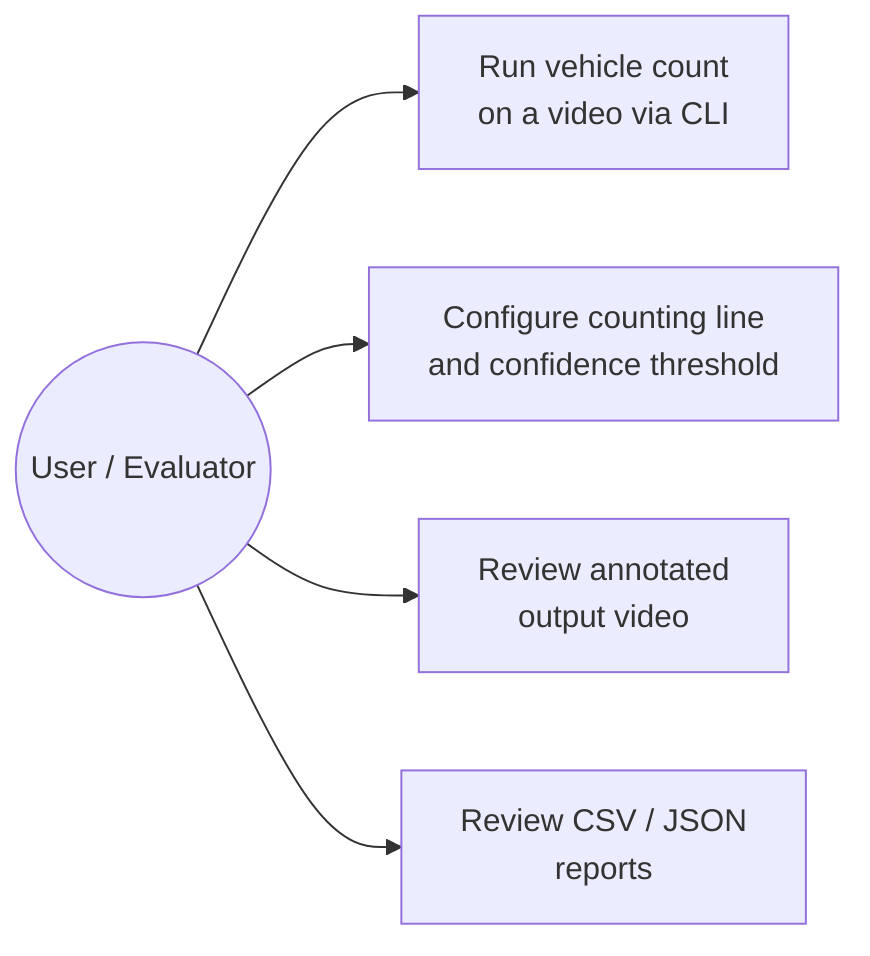
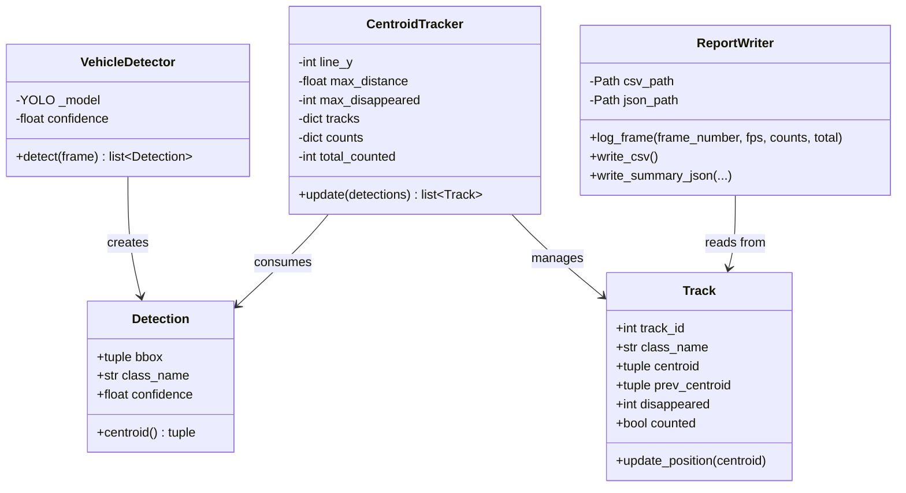
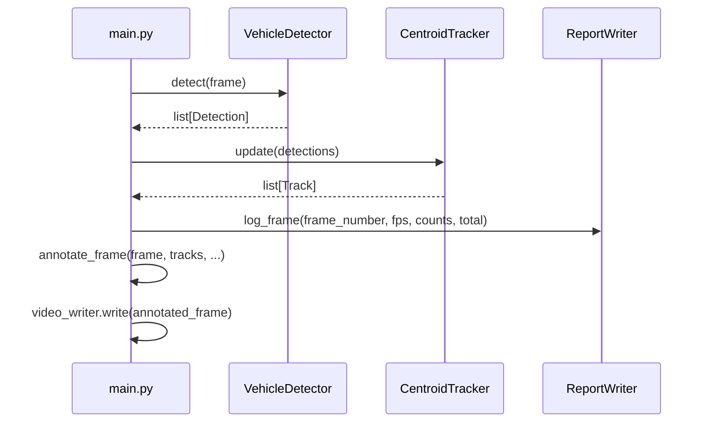

# Design Diagrams

These diagrams render natively on GitHub. They are also included as images
in the PDF project report.

## 1. System Architecture

## 2. Process / Workflow Diagram

## 3. Use Case Diagram

## 4. Class / Component Diagram

## 5. Sequence Diagram (single frame)

